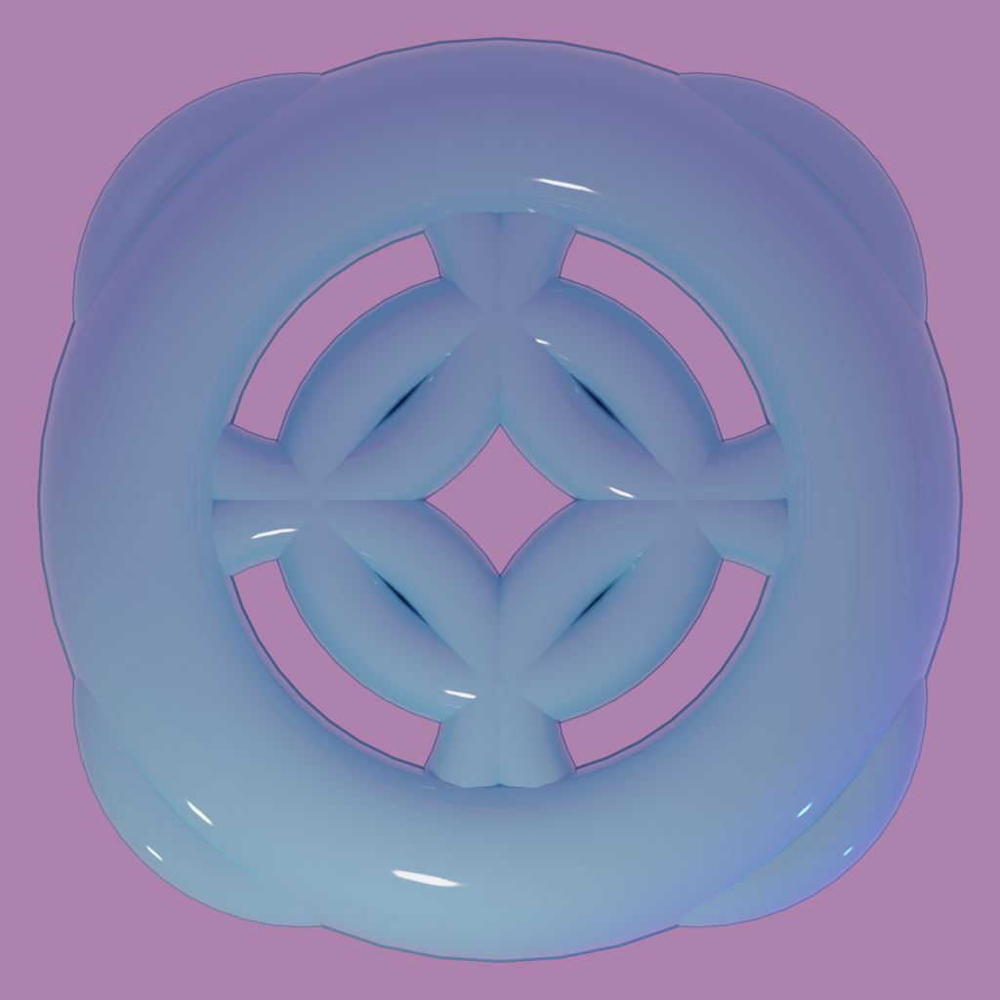

= Parametrický Fraktalizátor

image::renders/idkside.png[]

== Obsah
. link:#assignment[Zadání]
. link:#features[Co plugin umí]
. link:#installation[Instalace]
. link:#usage[Použití / Parametry]
.. link:#fs[Fraktální Segment]
.. link:#fl[Fraktální Vrstva]
. link:#code[Kód]
.. link:#fract[Fraktalizace]
.. link:#ui[User Interface]
. link:#examples[Příklady]
. link:#zdroje[Zdroje]

[#assignment]
== Zadání

```
Vytvořte plug-in do Blenderu generující parametrizovatelné fraktální objekty. 30b
```

[#features]
== Co plugin umí

Plugin umí "fraktalizovat" libovolný 3D objekt. V zásadě vytváří kopie vybraného objektu transformované zadanými parametry.

[#installation]
== Instalace
Plugin byl vytvořen pro Blender verze 2.8.

. Stáhněte si soubor `addon_generate_fract.py`.
. V blenderu jděte do nastavení (`Edit->Preferences...`).
. Klikněte v levém menu na "Add-ons".
. Klikněte na "Install...".
. Vyberte soubor z kroku 1.
. Zaškrtněte políčko aktivace pluginu "Generate: Generate Fractal"

[#usage]
== Použití / Parametry

Abyste mohli plugin spustit, musíte nejdříve vybrat nějaký objekt. Poté naleznete v menu v módu *Object Mode* na `Add -> Generate fractal from selected`.

Aby si mohl člověk s parametry co nejvíce vyhrát, implementoval jsem parametrizaci fraktalizace následovně, pomocí fraktálních vrstev a segmentů (vše hned osvětlím).

[#fs]
=== Fraktální Segment

Fraktálním segmentem nazývám jakousi "žílu" fraktálních rysů.

Každý segment je tvořen parametry:

* Scale (v kódu `scale_change`).
** Základní hodnota `0.5` znamená, že se každý další objekt zmenší na půlku.
* Direction (v kódu `location_change`).
** Lokální směr *vedoucí od originu fraktalizovaného objektu*, kam se budou pokládat jednotlivé objekty tohoto segmentu.
* Rotation (v kódu `rotation_change`).
** Každý objekt segmentu se otočí o zadanou rotaci.
* _Parametr Translation (v kódu `location_lerp`) zatím není implementován. V budoucnu bude sloužit k posunutí samotých objektů ve směru segmentu._

Nejlépe se to vysvětluje obrázkem. Zde je například plugin aplikován na kostku s parametrem Direction nastaveným na vektor (0, 0, 1). +


Pokud nyní změníme parametr Rotation na (15, 0, 0), každý objekt segmentu se nakloní kolem osy X: +


Přidáním dalšího segmentu segmentu, ovšem s parametrem Direction (0, -1, 0) můžeme objekt udělat komplexnější. +


[#fl]
=== Fraktální Vrstva

Fraktální vrsta je vlastně pouze kolekce fraktálních segmentů. Jednotlivé vrstvy se střídají při zanořování do rekurze (generování hlubších objektů). Díky tomu je možňé vytvářet komplexnější objekty. +


[#code]
== Kód

Kód tohoto pluginu je relativně přímočarý.

Plugin obsahuje 5 tříd:

* GenerateFractal - Operator
** Hlavní operátor pluginu.
** Volá metodu gen_layer(...), která rekurzivně generuje vrstvy fraktálu.
* POPUP_UL_generate_fractals - UIList
** Třída zajišťující renderování seznamu verstev a segmentů v UI pluginu.
* UIListActions - Operator
** Třída přidávající operace na práci se seznamem vrstev a segmentů.
* FractalLayerItem - PropertyGroup
** Třída obsahující kolekci FractalSegmentItem.
** layer_segments - kolekce.
* FractalSegmentItem - PropertyGroup
** Třída obsahující informace o segmentu.
** scale_change - Změna velikosti segmentu.
*** default = 0.5
** location_change - Směr generace daného segmentu.
*** default = (0, 0, 0)
** location_lerp - *NENAIMPLEMENTOVÁNO* - Translace generace ve směru `location_change`.
** rotation_change - Změna rotace daného segmentu.
*** default = (0, 0, 0)

[#fract]
=== Fraktalizace - gen_layer(self, root, object, layers, current_rotation, depth)

Funkce rekurzivně generující fraktální segmenty.

* Parametry
** self
*** Instance třídy GenerateFractal.
** root
*** Původní objekt, ze kterého generujeme.
** object
*** objekt z předchozí vrstvy, který použijeme na duplikaci a transformaci.
** layers
*** Kolekce všech vrstev.
** current_rotation
*** Rotace segmentu.
** depth
*** Současná hloubka.

Nejdříve zkontrolujeme, jestli už náhodou nemáme hotovo.
```python
if (depth <= 0):
    return
```

Poté vygenerujeme jednotlivé segmenty té správné vrstvy
```python
segment_id = 0

for segment in layers[(len(layers) - (self.depth - depth)) % len(layers)].layer_segments:
    new_object = object.copy()
    new_object.data = object.data.copy()
    self.view_layer.active_layer_collection.collection.objects.link(new_object)
    new_object.name = "Level" + str(depth) + ":" + str(segment_id)
    self.view_layer.update()
    self.view_layer.objects.active = new_object
    new_object.select_set(True)
```
Nechutně vypadající `(len(layers) - (self.depth - depth)) % len(layers)` slouží jako do nekonečna se opakující posloupnost od 0 do indexu poslední vrstvy. Vždy začíná na 0, a při "ponoru" do hlubší vrstvy se změní o 1.

Následují transformace nového objektu. Nejdříve objekt naškálujeme, poté musíme aktualizovat scénu, jinak nebude fungovat metoda ray_cast.
Poté směr segmentu, zadaný v lokálních souřadnicích, otočíme o `current_rotation`. Vyšleme paprsek ve směru otočeného směru a na místo dopadu posuneme nový objekt.
Poté rotaci segmentu otočíme (`current_rotation` musíme zachovat pro nadcházející segmenty), aplikujeme rotaci a škálu nového objektu, a nakonec zavoláme tuto metodu znovu, pro nový objekt, otočenou rotaci, a o 1 hlubší vrstvu.
```python
    new_object.scale = new_object.scale * (segment.scale_change)
    self.view_layer.update()
    rot = current_rotation.to_matrix()
    rot.invert()
    new_object.rotation_euler.rotate(Euler(segment.rotation_change))
    local_direction = (Vector(segment.location_change) @ rot).normalized()
    result, location, normal, index = new_object.ray_cast(origin=Vector((0, 0, 0)), direction=local_direction)
    if result:
        new_object.location += location
    else:
        # Whoops, looks like pivot isn't inside of the object
        print("WARNING: Raycast hasn't hit anything. Make sure segment Direction points towards mesh.")
        continue;
    self.view_layer.update()
    segment_rotation = current_rotation.copy()
    segment_rotation.rotate(Euler(segment.rotation_change))

    bpy.ops.object.transform_apply(location=False, scale=True, rotation=True)
    new_object.select_set(False)

    segment_id += 1

    gen_layer(self, root, new_object, layers, segment_rotation, depth - 1)
```

[#ui]
=== User Interface

Plugin používá funkci `invoke` třídy `Operator`, k vyvolání okna operátoru.

```python
def invoke(self, context, event):
    wm = context.window_manager
    return wm.invoke_props_dialog(self)
```

Poté v metodě `draw` vykreslí jednotlivé části UI. Nejdříve důležitá Property `depth`, určující hloubku rekurze, poté seznam vrstev, a nakonec tlačítka na přidávání a odebírání vrstev.

```python
def draw(self, context):
    layout = self.layout
    scene = context.scene
    col = layout.column()
    col.prop(self, "depth")
    row = col.row()
    row.label(text="Layers")
    row.label(text=str(len(scene.fractal_layers)))

    col = layout.column()

    col.template_list(
        "POPUP_UL_generate_fractals",
        "",
        scene,
        "fractal_layers",
        self,
        "index",
        rows=2
    )

    row = col.row(align=True)
    add_layer_button = row.operator(
        "custom.generate_fractal_list_action",
        icon='ADD',
        text="Add layer"
    )
    add_layer_button.action = 'ADD'
    add_layer_button.index = 0
    remove_layer_button = row.operator(
        "custom.generate_fractal_list_action",
        icon='REMOVE',
        text="Remove last layer"
    )
    remove_layer_button.action = 'REMOVE'
    remove_layer_button.index = 0
```
Python bohužel neumí dynamicky vykreslit pole/seznam, a už vůbec ne seznam seznamů, který jsem potřeboval já. Proto jsem musel vytvořit pomocnou třídu `POPUP_UL_generate_fractals`, která vykresluje jednotlivé položky seznamu.

Jednou možností bylo udělat ještě druhou pomocnou třídu, která by vykreslovala seznam segmentů, ovšem já jsem se rozhodl vykreslovat jednotlivé segmenty rovnou v prvním seznamu pomocí cyklu.

Vytvoření nápisu vrstvy + tlačítka na přidání segmentu.
```python
col = layout.column()
row = col.row()
row.label(text="Layer " + str(index))
add_segment_button = row.operator("custom.generate_fractal_list_action", icon='ADD', text="Add segment")
add_segment_button.action = 'SADD'
add_segment_button.index = index
```
Přidání všech segmentů.
```python
for i in range(len(context.scene.fractal_layers[index].layer_segments)):
    row = col.row(align=True)
    column = row.column()
    column.label(text="Segment " + str(i))
    segment = context.scene.fractal_layers[index].layer_segments[i]
    subrow = column.row()
    subrow.prop(segment, "location_change")
    subrow = column.row()
    subrow.prop(segment, "rotation_change")
    subrow = column.row()
    subrow.prop(segment, "scale_change")
    subrow.prop(segment, "location_lerp")
    remove_segment_button = row.operator("custom.generate_fractal_list_action", icon='PANEL_CLOSE', text="")
    remove_segment_button.action = 'SREMOVE'
    remove_segment_button.index = index
    remove_segment_button.segment_index = i
```

[#examples]
== Obrázky

Animace ukazující generování jednotlivých vrstev:


image::renders/idk.png[]
image::renders/ortocube.png[]

Fraktalizace objektů, jejichž pivot se nenachází uvnitř nich samých, je pro plugin obtížná.



Pokus o vytvoření jakési rostliny:

image::renders/kapradi.png[]


[#zdroje]
== Zdroje

. Pro tento plugin jsem k vývoji nepoužil žádných zdrojů kromě Blender Python API.
